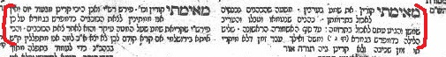
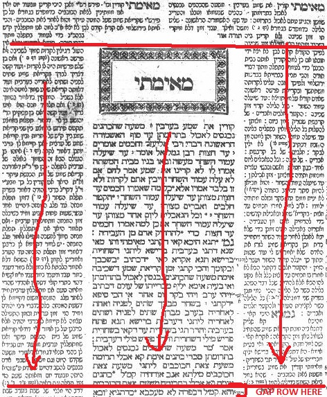

# Talmudifier

**Generate PDFs with page layouts similar to the [Talmud](https://en.wikipedia.org/wiki/Talmud#/media/File:First_page_of_the_first_tractate_of_the_Talmud_(Daf_Beis_of_Maseches_Brachos).jpg).**

Given three paragraphs of markdown text, Talmudifier will generate a .pdf file using XeTeX (via Rust's tectonic crate). You can also include a title, basic styling (bold, italic, etc.) and marginalia.

This is a Rust port of my [Talmudifier Python module](https://github.com/subalterngames/talmudifier). It's faster now.


```rust
use std::{fs::write, path::PathBuf, str::FromStr};

use talmudifier::prelude::*;

let directory = PathBuf::from_str("example_text").unwrap();

// Load a default talmudifier.
let mut talmudifier = Talmudifier::default()
    // Add a title to the page.
    .title("Talmudifier")
    // Set the source text as three Markdown files.
    .source_text(SourceText::Files {
        left: directory.join("left.md"),
        center: directory.join("center.md"),
        right: directory.join("right.md")
});

// Talmudify.
let daf = talmudifier.talmudify().unwrap();

// Write the .tex. This is sometimes useful for debugging.
write("out.tex", &daf.tex).unwrap();

// Write the PDF.
write("out.pdf", &daf.pdf).unwrap();
```

## Getting started

It's easy! You don't need to be a programmer to use Talmudifier.

1. [Download and extract this repo](https://github.com/subalterngames/talmudifier-rs/archive/refs/heads/main.zip)
2. [Download and install Rust](https://www.rust-lang.org/tools/install)
3. Open a terminal shell. 
  - Windows: Search for `powershell` and run it
  - macOS: Search for `terminal` and run it
  - Linux: You know what to do
4. In the terminal, type `cd [PATH]` and press enter. *Do not literally type* `[PATH]`. That's a substitute word for whatever the actual path to the repo is. For example, if you extracted the repo in Downloads, then: `cd ~/Downloads/talmudifier`
5. [Compile as an executable](#compile-as-an-executable)
6. [Create a valid talmudifier.json file](#talmudifierjson)

## Compile as an executable

Talmudifier can be compiled as an executable:

```bash,ignore
cargo build --release --bin talmudify --features clap
```

This will create: `target/release/talmudify`. You can run it like any other shell program: `./talmudify [ARGS]`

```ignore
Usage: talmudify [OPTIONS]

Options:
  -t, --talmudifier <TALMUDIFIER>  The path to a talmudifier json file. If this arg is not included, and if the default-fonts feature is enabled, then default values will be used [default: talmudifier.json]
  -o, --out <OUT>                  The path to the output directory [default: out]
  -l, --log                        If included, write intermediate .tex and .pdf files to logs/. This is useful for debugging but slow.
  -h, --help                       Print help
  -V, --version                    Print version
```

## talmudifier.json

Talmudifier uses JSON config files for typesetting. `example_talmudifier.json` is an example config file. To make your own config file, copy+paste the example and edit as needed. It should be mostly human-readable.

### Length values

Many of the values in the config file are measurements of lengths. The following units are valid: `"In"`, `"Cm"`, `"Mm"`, `"Pt"`, `"Em"`. *However*, there are many cases in which `"Em"` is not valid. This is because many of the lengths need to be converted to Pts and there's no easy way to do what with Ems because they're font-specific. I recommend using Em for values only where `example_talmdufier.json` uses Em.

### Fonts

`"fonts"` has a default value of `null`, in which case default fonts embedded in the executable are used. You can set this to use other fonts. See `example_fonts.json`; you can replace `null` with the text in `example_fonts.json` (assuming that the files actually exist).

Limitations:

- Each font style (regular, bold, etc.) *must* be a separate file.
- A column's font files must all be in the same directory.
- System fonts are not supported.


### Source text

`"source_text"` specifies the source text that will be talmdufied. There are three options:

1. File paths to three markdown files. These files must exist and must be single paragraphs (no double line breaks):

```ignore
"Files": {
    "left": "left.md",
    "center": "center.md",
    "right": "right.md"
}
```

2. Three markdown strings:

```ignore
"Text": {
    "left": "This is the left column.",
    "center": "This is the center column.",
    "right": "This is the right column."
}
```

3. A single markdown file with exactly three paragraphs:

Example JSON:

```ignore
"File": "text.md"
```

An example file:

```ignore
This is the left column.

This is the center column.

This is the right column.
```

A very subset of markdown is used in Talmudifier:

For the most part, just type text like you normally would. You can italicize text like \*this\*. You can make text bold like \*\*this\*\*. You can make bold and italic text like \*\*\*this\*\*\*. \*\*You can make multiple words bold and you can \*italicize\* within bold text\*\* (\*and \*\*vice\*\* versa\*). \`If you want to add marginalia, use graves.\`

Links, images, headers, emoji, etc. are not supported.

### Title

By default, `"title"` is set to `null`. Set it to something else to add a title to the page:

`"title": "Chapter 1"`

### Logging

Set `"log": true` to enable logging. This will generated intermediary files per iteration that can be useful for debugging. This will also make Talmudifier run slower.

## How it works

The Talmud's typesetting dates back to the invention of the printing press. Printmaking was easy but paper was expensive so people crammed several texts onto a single page. The standard "Talmud page layout" is actually the Talmud as printed in the Vilna Shas, and other page layouts are possible.

There are rules defining how to typeset a Talmud page. The Vilna Shas predates the formalization of iterative algorithms, so some pages follow the rules less strictly than others. Talmudifier strictly follows the following rules:

1. There are always three columns of text
2. Whenever possible, the page starts with four lines of text in the left and right columns followed by a "gap" row to give the center column some breating space:
  
3. After this, columns are typeset using the following algorithm until there is no more text:
  - Each column can have a different typeface (most famously, Rashi's commentary has its own typeface).
  - The widths of the columns are determined by which columns still have text. For example, if the left and right columns have text that needs to be typeset but the center column doesn't, then the column widths are each half of the total width of the table.
  - Find the column with the least number of lines (*n*).
  - Add all columns that still have text to the page up to *n* lines (or, if there isn't enough text, just add all remaining text).
  - Marginalia is always in-line with the text that it is commenting on.
  - For the columns that still have text, add "gap" rows.
  

For more information, read: `Printing the Talmud : a history of the earliest printed editions of the Talmud by Martin Heller`

There is a fundamental problem in the typesetting algorithm: We need to iteratively get the number of lines in a column. In LaTeX, there's no way to know the number of lines in a column until it's rendered. Therefore, Talmudifier uses the following algorithm:

1. Create a table that has text only in one column (the one we're trying to measure).
2. Generate a PDF with XeTeX in-memory.
3. Extract the text from the PDF.
4. Count the number of lines.
5. Add or subtract a word as needed, and repeat the process until the column is filled up to the target number of lines.

This process is *slow* and it's why Talmudifier takes so long to render a page.

Traditionally, this process would be sped up by experienced typesetters because they'd be able to eyeball how many character blocks would fit in a rectangle. Talmudifier also uses a heuristic to speed things up: Cosmic Text, a Rust crate meant for formatting text in a GUI app, renders the text, using the same algorithm as described above. Cosmic Text is *fast* and this algorithm returns a guess as to the total number of words in a column that Talmudifier then uses to start the TeX portion of the algorithm. Cosmic Text's guess is rarely exactly correct because Cosmic Text isn't TeX and will typeset blocks of text differently.

## Feature flags

- `default-fonts` embeds default fonts into the executable. You might want to remove this if you want to use other fonts because the default fonts make the binary bigger.
- `ffi` is required by the underlying PDF generator (`tectonic`). *Always include this feature.*
- `clap` is required for some of the executables. If you're using Talmudifier as a library, you can ignore this.

## Changes from Python

This is a Rust port of my `talmudifier` Python module. Major differences include:

- It's much faster.
- No external TeX engine needed. Talmudifier has its own internal TeX engine.
- No need to download any TeX packages. Talmudifier will download the required packages for you.
- Use Cosmic Text to guess the end index that is then used to generate a TeX column of a specified number of lines. Previously, I was using hard-coded guesses to do this. Cosmic Text is much more flexible and accurate.
- Default fonts are automatically included
- Simplified the config file
- No longer supported:
  - 1-1 word/character substitutions
  - Colorization of specific words

## Other executables

To regenerate `example_talmudifier.json`:

```bash,ignore
cargo run --bin example_config
```

To convert an arbitrary .tex file into a .pdf (useful for debugging):

```bash,ignore
cargo run --bin textest --features clap -d directory/ -f filename.tex
```

The `-d` argument is optional and defaults to `logs/`.